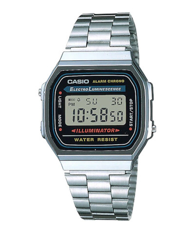
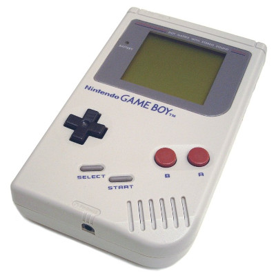

# ***-BiGTiME-***


**bigtime** is a customizable clock for the terminal, written in bash.

*depends on: alsa-utils, bash, coreutils, libnotify, ncurses*

# Table of Contents

* [INSPIRATION](#inspiration)
* [INSTALLATION](#installation)
* [DISPLAY](#display)
* [USAGE](#usage)
* [ALARM](#alarm)
* [TIMER](#timer)
* [KEY BINDINGS](#key-bindings)
* [TIMEZONE](#timezone)
* [DIGITS FILE](#digits-file)
* [UNINSTALL](#uninstall)
* [CREDITS](#credits)
* [CHANGELOG](#changelog)


# INSPIRATION <a name="inspiration"></a>

## The Concept

## The Sound

## The Colors

## The Name
[Peter Gabriel: Big Time](https://invidio.us/watch?v=PBAl9cchQac)

# INSTALLATION <a name="installation"></a>

You can find **bigtime** in the [Arch User Repository](https://aur.archlinux.org/packages/bigtime).

## Clone this repository:

`git clone https://github.com/teegre/bigtime.git`

## Install **bigtime**

`make install`

# DISPLAY <a name="display"></a>

*Vertical display with date and small seconds:*  
`bigtime -dsv`  
```
 ∎∎∎  ∎∎∎∎∎ TU
∎   ∎     ∎ 07
∎ ∎ ∎    ∎  28
∎   ∎   ∎
 ∎∎∎   ∎    PM

∎∎∎∎   ∎∎∎
∎     ∎   ∎
∎∎∎∎     ∎
    ∎   ∎
∎∎∎∎  ∎∎∎∎∎ 46
```

*Horizontal display with big seconds:*  
`bigtime -S`  
```
 ∎∎∎  ∎∎∎∎∎     ∎∎∎∎    ∎         ∎     ∎
∎   ∎     ∎     ∎      ∎∎        ∎∎    ∎
∎ ∎ ∎    ∎      ∎∎∎∎    ∎         ∎   ∎∎∎∎
∎   ∎   ∎    ∎      ∎   ∎    ∎    ∎   ∎   ∎
 ∎∎∎   ∎     ∎  ∎∎∎∎   ∎∎∎   ∎   ∎∎∎   ∎∎∎  PM

```

## Indicators
Indicator are displayed on the left hand side of the clock:

* `×`   - hourly time signal activated.
* `a`   - daily alarm activated.
* `t`   - timer activated.
* `>a`  - alarm display mode.
* `a<`  - alarm setting mode.
* `a!`  - alarm is ringing.
* `Zzz` - alarm snooze mode.
* `>t`  - timer display mode.
* `t<`  - timer setting mode.
* `t!`  - timer is ringing.

## USAGE <a name="usage"></a>

bigtime [OPTION [VALUE] ... OPTION [VALUE]]

OPTIONS:

* -s, --small-seconds      - show seconds (normal size).
* -S, --big-seconds        - show seconds (big size).
* -d, --date               - show date.
* -f                       - display time in 24h format.
* -z, --timezone           - show timezone (i.e. +0200).
* -F, --foreground 0..N    - set foreground color.
* -B, --background 0..N    - set background color.
* -r, --rainbow            - rainbow effect (override -n and -F options).
* -n, --random             - random colors effect (override -r and -F options).
* -C, --list-colors        - print available colors and exit.
* -b, --blink              - blinking separators.
* -a, --alarm TIME         - set daily alarm (TIME format: [H]H:MM[ AM|am|PM|pm])
* -t, --timer DURATION     - set timer (DURATION format: [H]H:MM[:SS]).
* -i, --signal             - activate hourly time signal.
* -v, --vertical           - display clock vertically.
* --file FILENAME          - use a custom digits file (filename only).
* -w, --preview            - (with --file) display a preview of the selected file and exit.
* -l, --list-files         - print available digits files and exit.
* -q, --quiet              - disable sound, alarm, timer and hourly time signal.
* -h, --help               - print this help message and exit.
* -V, --version            - print program's version and exit.

# ALARM <a name="alarm"></a>

## From the command line
To set a daily alarm starting at 7:00 AM:  
`bigtime --alarm "7:00 AM"`

To test the alarm (actually don't set an alarm):  
`bigtime --alarm "now"`

Press <kbd>space</kbd> to stop the alarm.  

## From within the application

Press <kbd>a</kbd> to set a new alarm.  
To modify an existing alarm, press <kbd>space</kbd> and <kbd>a</kbd>.  
Enter the desired time.  
Press <kbd>j</kbd> or <kbd>k</kbd> to select next/previous digit.  
Press <kbd>p</kbd> to toggle AM/PM.

When done, press <kbd>a</kbd> to enable the alarm.

Or press <kbd>space</kbd> to cancel.

# TIMER <a name="timer"></a>

## From the command line
To set a 3 minutes and 30 seconds timer:  
`bigtime --timer "0:03:30"`

## From within the application

Press <kbd>t</kbd> to set a new timer.  
To modify an existing timer, press <kbd>space</kbd> (twice if an alarm is set) and <kbd>t</kbd>.  
Enter the desired duration.  
Press <kbd>j</kbd> or <kbd>k</kbd> to select next/previous digit.  
Press <kbd>r</kbd> to reset current timer.

When done, press <kbd>t</kbd> to confirm.

Or press <kbd>space</kbd> to cancel.

# KEY BINDINGS <a name="key-bindings"></a>

* <kbd>a</kbd>     - toggle daily alarm; set/confirm new alarm; disable **snooze** mode.
* <kbd>h</kbd>     - toggle hourly time signal.
* <kbd>j</kbd>     - select next digit (setting mode)
* <kbd>k</kbd>     - select previous digit (setting mode)
* <kbd>p</kbd>     - toggle 24h format / toggle AM/PM (alarm setting mode)
* <kbd>q</kbd>     - exit program
* <kbd>r</kbd>     - reset timer (timer setting mode)
* <kbd>t</kbd>     - toggle timer; set/confirm new timer
* <kbd>R</kbd>     - refresh screen
* <kbd>space</kbd> - toggle display mode; stop; cancel (setting mode)

# TIMEZONE <a name="timezone"></a>

To display the time for a different timezone:  
```TZ=Europe/Paris bigtime```

# DIGITS FILE <a name="digits-file"></a>

In a nutshell, a *digits file* is a text file with the **.digits** extension  
that contains instructions on how to draw digits on the screen.

Digits are sequences of 0s and 1s.

Global settings for digits and separator are defined as follow:

```
height=5
width=5
sep_width=1
```
The **layout** optional parameter can be used to force the clock to display in a particular layout.

`layout=horizontal`  
Or  
`layout=vertical`

If this parameter is omitted, horizontal mode is the default unless **--vertical** option is used.

By default, when **bigtime** parses a file, 0s are replaced by whitespaces and 1s by "∎".  
But one can define characters as shown below:

```
char=@
space=-
```

Digits and separator are defined by a semicolon separated list, as follow:

```
0=11111;11011;11011;11011;11111
...
9=11111;11011;11111;00011;11111
separator=0;1;0;1;0
blank=0;0;0;0;0
```
With the characters defined earlier, this:

```
11111
11011
11011
11011
11111
```

Becomes this:

```
@@@@@
@@-@@
@@-@@
@@-@@
@@@@@
```

So far, so good...  
**You can find more examples in "/etc/bigtime/digits" directory**

Custom digits files must be stored in **bigtime** configuration directory:  
`$HOME/.config/bigtime`

**Note**: Whenever **bigtime** encounters a mistake in a **digits file**,  
it will throw an error and a useful description.

# UNINSTALL <a name="uninstall"></a>

`make uninstall`

# CREDITS <a name="credits"></a>

* Sound effects made with the excellent [sfxr](http://www.drpetter.se/project_sfxr.html)
* Icons taken from [Material Design Icons](https://materialdesignicons.com/)

# CHANGELOG <a name="changelog"></a>

## Version 20200804-1.2.4.4

* Bug fixes

## Version 20200803-1.2.4.3

* Minor bug fixes

## Version 20200802-1.2.4.2

* Added optional **layout** setting to digits file.  
* Added simple animation when quitting **bigtime**.
* Added **lcd2.digits**.

## Version 20200801-1.2.4.1

* Added **-l** option back.
* Disable snooze mode with <kbd>a</kbd>.
* Fixed wrong character in some digits file.
* Added **--quiet** option (disable sound, alarm, timer and hourly time signal)
* From now on, timer cannot be less than 5 seconds.
* Added libnotify dependency.

## Version 20200731-1.2.3

* Removed **--char**, **--space**, **--preset** and **--list-presets** options.
* Added optional **char** and **space** settings for digits file.  
**Bigtime** will use the default characters if these parameters are missing.
* Stock digits files and documentation have been changed accordingly.
* Added **--preview** option.
* Improved alarm setting from the commandline.
* Added snooze indicator.
* Added lcd.digits.
* Added cross.digits.
* Added CREDITS section to README.md

## Version 20200730-1.2.2

* Terminal title now updates correctly.
* **-c** and **-p** options only accept 1 alphanumeric character.
* Fixed bug: set timer after entering a wrong digit.
* Fixed bug: set timer after a reset.
* When timed out, now display a notification.
* Added icons to notifications.
* Inspiration section, some pictures and animated GIF added to **README.md**.

## Version 20200728-1.2.1

* Automatic snooze: after 1 minute, alarm stops and the clock enter snooze mode.  
Alarm will sound again after 5 minutes. Snooze mode is deactivated only if <kbd>space</kbd>  
is explicitly pressed, if alarm is disabled or if a new alarm is set.
* In alarm/timer display/setting mode, go back to time display after a period of inactivity.
* Changed alarm and timer indicators.
* Added timezone (+0000 format).
* rainbow and random mode are mutually exclusive.
* Changed default digits file.
* New installation process.

## Version 20200727-1.2

* New rainbow and random effects.
* Fixed minor bugs

## Version 20200725-1.1

* Added a little splash screen.

## Version 20200725-1.0

* Complete rewrite
* Added timer
* Added more sound effects
