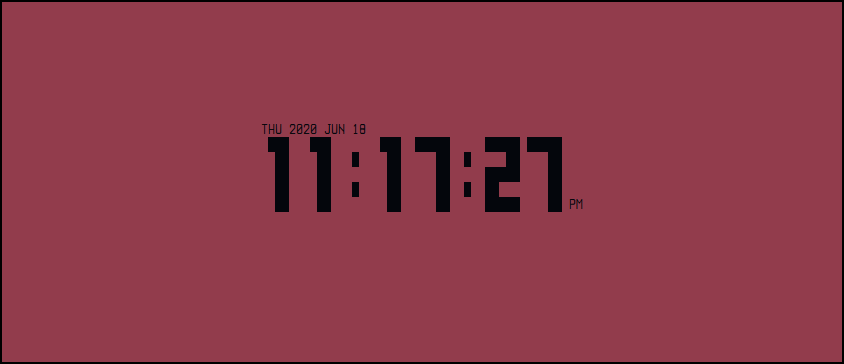
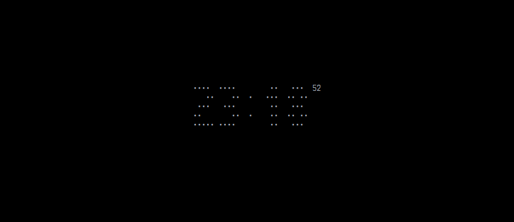
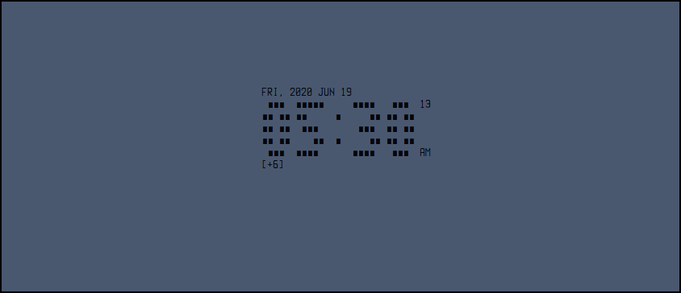
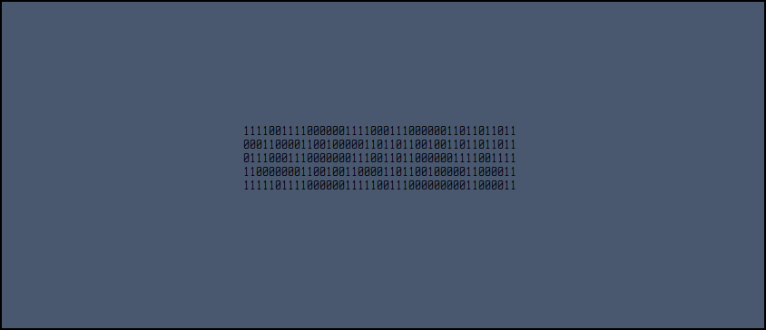

# **bigtime** version 0.2 (06-2020)

**bigtime** is a customizable clock for the terminal, written in bash.

  
  
  
  
  
  

## 1. Installation

### 1.1 Clone this repository:

`git clone https://github.com/teegre/bigtime.git`

### 1.2 Install **bigtime**

`./install.sh`

## 2. Usage

bigtime [options values]

OPTIONS:

* -c, --char [char]        - character for digits (default is █)
* -p, --space [char]       - character for whitespaces (default is " ")
* -f                       - display time in 24h format
* --offset [hours]         - hours to be added to current time
* -s, --small-seconds      - show seconds (normal size)
* -S, --big-seconds        - show seconds (big size)
* -d, --date               - show date
* -D, --date-format        - date format(1)
* -b, --blink              - blinking separators
* -v, --vertical           - display clock vertically
* --file [filename]        - use a custom digits file (filename only)
* -l, --list-files         - print available digits files
* --preset [0..n]          - use predefined characters (override -c and -p options)
* -P, --list-presets       - print available presets
* -F, --foreground [0..n]  - set foreground color(2)
* -B, --background [0..n]  - set background color(2)
* -C, --list-colors        - print available colors
* -h, --help               - print this help message and exit
* -V, --version            - print program's version and exit

(1): date format:

* %W: abbr. weekday name
* %m: abbr. month name
* %M: month
* %D: day of month
* %Y: year

## 3. Key bindings

* q - exit program
* R - restore default terminal colors
* r - refresh screen

## 4. Custom digits file

Basically a digit file contains instructions on how to draw digits on the screen.  
They have the *.digits* extension and must be stored in **bigtime** configuration  
directory: `$HOME/.config/bigtime`

### 4.1 Size

All digits must have the same size (in characters) which is defined as follow:  
`height=5`  
`width=5`

The separator can have a different width but must have the same height as digits:  
`sep_width=2`

### 4.2 Digits, separator and blank

They are sequences of 0s and 1s, for instance:  

```
11111
11011
11011
11011
11111
```  
represents digit 0, and it is stored as:  
`0=11111;11011;11011;11011;11111`  

By default, when launched, **bigtime** replaces 0 by whitespace and 1 by █ 

## 4.3 Example: narrow.digits file

```
width=3
height=5
sep_width=1
0=111;101;101;101;111
1=110;010;010;010;010
2=111;001;111;100;111
3=111;001;111;001;111
4=101;101;111;001;001
5=111;100;111;001;111
6=111;100;111;101;111
7=111;001;001;001;001
8=111;101;111;101;111
9=111;101;111;001;111
separator=0;0;0;0;1
blank=0;0;0;0;0
```

## 5. TODO

* Fix redraw issue that sometimes occurs when resizing terminal
* Fix original title not restored in tmux
* Find a more reliable way to format date output
