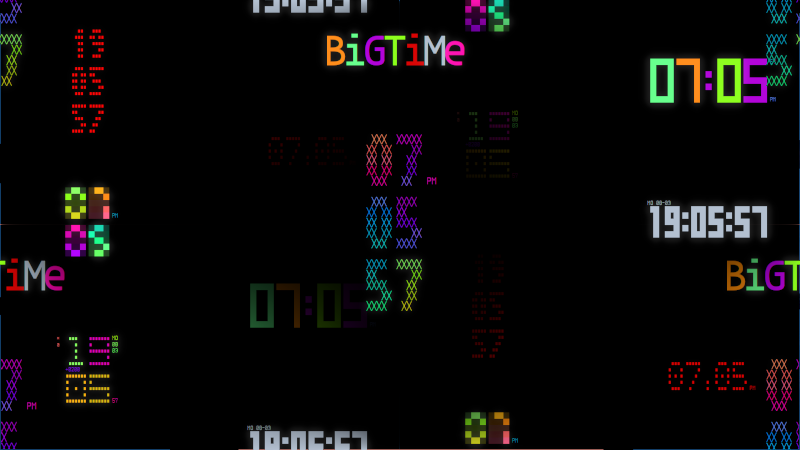
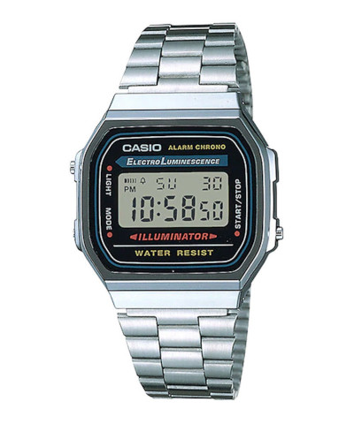
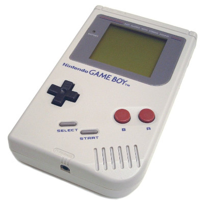
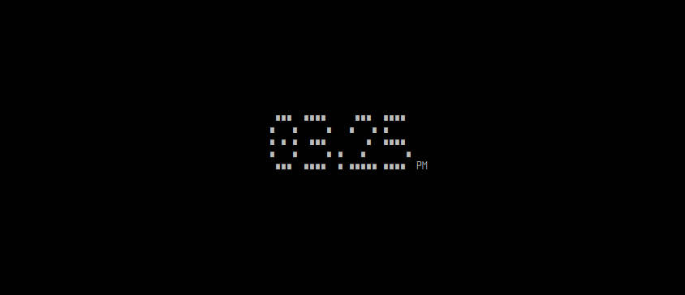
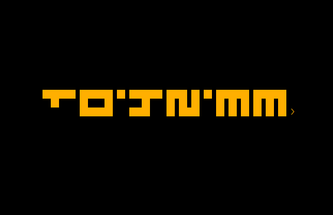

# ***-B!GT!ME-***



**bigtime** is a customizable clock for the terminal, written in bash.

*depends on: bash, coreutils, libpulse, libnotify, ncurses*

Tested on these terminals:  
st, xterm, urxvt, sakura and alacritty (font used: TerminessTTF Nerd Font Mono).

# Table of Contents

* [INSPIRATION](#inspiration)
* [EXAMPLES](#examples)
* [INSTALLATION](#installation)
* [USAGE](#usage)
* [KEY BINDINGS](#key-bindings)
* [ALARM](#alarm)
* [TIMER](#timer)
* [TIMEZONE](#timezone)
* [DIGITS FILE](#digits-file)
* [UNINSTALL](#uninstall)
* [CREDITS](#credits)

# INSPIRATION <a name="inspiration"></a>

## The Concept

## The Sound

## The Colors

## The Name
[Peter Gabriel: Big Time](https://youtube.com/watch?v=PBAl9cchQac)

# EXAMPLES <a name="examples"></a>

Here are some examples along with their associated commands

## STANDARD


`bigtime`

## SIMPLE


`bigtime --file simple --big-seconds --rainbow`

## BASIC


`bigtime --file basic --random`

## BLOCK


`bigtime --file block`

## DIGITAL


`bigtime --file digital --date -f --rainbow --small-seconds --vertical`

## BLOCK2


`bigtime --file block2 --foreground 125`

## FLIP



`bigtime -S --file flip --foreground 214`


`bigtime -nSv --file flip`

# INSTALLATION <a name="installation"></a>

You can find **bigtime** in the [Arch User Repository](https://aur.archlinux.org/packages/bigtime).

## Clone this repository:

`git clone https://github.com/teegre/bigtime.git`

## Install **bigtime**

`make install`

# USAGE <a name="usage"></a>

bigtime [OPTION [VALUE] ... OPTION [VALUE]]

OPTIONS:

* -s, --small-seconds      - show seconds (normal size).
* -S, --big-seconds        - show seconds (big size).
* -d, --date               - show date.
* -f                       - display time in 24h format.
* -z, --timezone           - show timezone (i.e. +0200).
* -F, --foreground 0..N    - set foreground color.
* -B, --background 0..N    - set background color.
* -r, --rainbow            - rainbow effect (override -n and -F options).
* -n, --random             - random colors effect (override -r and -F options).
* -C, --list-colors        - print available colors and exit.
* -b, --blink              - blinking separators.
* -N, --no-separator       - do not display separators (horizontal layout only).
* -a, --alarm TIME         - set daily alarm (TIME format: [H]H:MM[AM|am|PM|pm])
* -t, --timer DURATION     - set timer (DURATION format: [H]H:MM).
* -i, --signal             - activate hourly time signal.
* -v, --vertical           - display clock vertically.
* --file FILENAME          - use a custom **digits file** (filename only).
* -w, --preview            - (with --file) display a preview of the selected file and exit.
* -l, --list-files         - print available **digits files** and exit.
* -e, --edit FILENAME      - create and/or edit a custom **digits file** (filename only).
* -q, --quiet              - disable sound, alarm, timer and hourly time signal.
* -h, --help               - print this help message and exit.
* -V, --version            - print program's version and exit.

# INDICATORS
Indicator are displayed on the left hand side of the clock:

* `*`   - hourly time signal activated.
* `a`   - daily alarm activated.
* `t`   - timer activated.
* `>a`  - alarm display mode.
* `a>`  - alarm setting mode.
* `a`   - alarm is ringing (blinking).
* `z`   - alarm snooze mode.
* `>t`  - timer display mode.
* `t>`  - timer setting mode.
* `t`  - timer is ringing (blinking).

These are the default indicators but they can be changed (see [DIGITS FILE](#digits-file) section).

# KEY BINDINGS <a name="key-bindings"></a>

* <kbd>a</kbd>     - toggle daily alarm; set/confirm new alarm; disable **snooze** mode.
* <kbd>f</kbd>     - toggle 24h format; toggle AM/PM (alarm setting mode).
* <kbd>i</kbd>     - toggle hourly time signal.
* <kbd>j</kbd>     - select next digit (setting mode).
* <kbd>k</kbd>     - select previous digit (setting mode).
* <kbd>q</kbd>     - exit program.
* <kbd>R</kbd>     - refresh screen.
* <kbd>t</kbd>     - toggle timer; set/confirm new timer.
* <kbd>space</kbd> - toggle display mode; stop; cancel (setting mode).

# ALARM <a name="alarm"></a>

## From the command line

To set a daily alarm starting at 7:00 AM:  
`bigtime --alarm "7:00 AM"`

To test the alarm (actually don't set an alarm):  
`bigtime --alarm "now"`

Press <kbd>space</kbd> to stop the alarm.  

## From within the application

```
                               SET ALARM
   ∎    ∎∎∎     ∎∎∎   ∎∎∎     ∎∎∎   ∎∎∎  M
  ∎∎   ∎   ∎   ∎   ∎ ∎   ∎   ∎   ∎ ∎   ∎
   ∎      ∎    ∎ ∎ ∎ ∎ ∎ ∎   ∎ ∎ ∎  ∎∎∎∎
   ∎     ∎   ∎ ∎   ∎ ∎   ∎   ∎   ∎    ∎
  ∎∎∎  ∎∎∎∎∎ ∎  ∎∎∎   ∎∎∎     ∎∎∎    ∎   AM
 12:52p
```

Press <kbd>a</kbd> to set a new alarm.  
To modify an existing alarm, press <kbd>space</kbd> and <kbd>a</kbd>.  
Enter the desired time.  
Press <kbd>j</kbd> or <kbd>k</kbd> to select next/previous digit.  
*The last two digits are snooze duration in minutes (from 5 to 15)*  
*Note: as opposed to alarm setting, when snooze duration is modified,  
changes are applied immediately.*

Press <kbd>f</kbd> to toggle AM/PM if necessary.

When done, press <kbd>a</kbd> to activate alarm.

Or press <kbd>space</kbd> to cancel.

# TIMER <a name="timer"></a>

## From the command line

To set a 3 minutes timer:  
`bigtime --timer 0:03`

## From within the application

Press <kbd>t</kbd> to set a new timer.  
To modify an existing timer, press <kbd>space</kbd> (twice if an alarm is set) and <kbd>t</kbd>.  
Enter the desired duration (from 1 minute to 23 hours and 59 minutes).  
Press <kbd>j</kbd> or <kbd>k</kbd> to select next/previous digit.  

When done, press <kbd>t</kbd> to confirm.

Or press <kbd>space</kbd> to cancel.

# TIMEZONE <a name="timezone"></a>

To display the time for a different timezone, i.e.:  
```TZ=Europe/Paris bigtime```

# DIGITS FILE <a name="digits-file"></a>

In a nutshell, a **digits file** is a text file with the **.digits** extension  
that contains instructions on how to draw digits on the screen.

Digits are sequences of 0s and 1s and are defined as semicolon separated lists.  
**Bigtime** needs some clue about digits geometry (height and width in characters).

Some other *optional* parameters are available, like layout, colors and indicators.  
If these parameters are omitted or left blank, default values are used or values  
specified via the command line options.

## GEOMETRY

* height=*integer*    - height of a digit, in characters. **[mandatory]**
* width=*integer*     - width of a digit, in characters.  **[mandatory]**
* sep_width=*integer* - width of a separator, in characters. **[optional]**

### Example:

```
height=5
width=5
sep_width=3
```

## LAYOUT

* layout=*horizontal*|*vertical*

The **layout** optional parameter can be used to force the clock to display in a particular layout.

## COLORS

* colors=*list*|*rainbow*|*random*
* background=*integer*
* foreground=*integer*

**colors** parameter can be either a semicolon separated list of 11 colors (so that every digit/separator is  
assigned a color), **rainbow** (equivalent of **--rainbow**), or **random** (equivalent of **--random**).

Integer value is a color number as shown by **--list-colors** option.

*Note:* **colors command line options supersede** these parameters.

## SECONDS

* seconds=*big*|*small*

Equivalent to **--big-seconds** and **--small-seconds** options.

## INDICATORS

* am_indicator=*string*
* pm_indicator=*string*
* signal_indicator=*char*
* alarm_indicator=*char*
* snooze_indicator=*char*
* timer_indicator=*char*

## DIGITS

* 0-9=*list*
* separator=*list*
* blank=*list*

As stated before, a digit is defined by a semicolon separated list.  
For example:

```
0=11111;11011;11011;11011;11111
...
9=11111;11011;11111;00011;11111
separator=000;010;000;010;000
blank=000;000;000;000;000
```

## FILLED SPACE, EMPTY SPACE

* char=char  - character to display as filled space (1).
* space=char - character to display as empty space (0).

By default, when **bigtime** parses a file, 0s are replaced by whitespaces and 1s by "∎".  
But one can define characters as shown below:

```
char=@
space=-
```

Given the characters defined earlier, this (0):

```
11111
11011
11011
11011
11111
```

Becomes this:

```
@@@@@
@@-@@
@@-@@
@@-@@
@@@@@
```

So far, so good...  

## MAKE YOUR OWN DIGITS FILE

You can find more examples in "/etc/bigtime/digits" directory

Custom **digits files** must be stored in **bigtime** configuration directory:  
`$HOME/.config/bigtime`

You can use the **--edit** option to create a new file from a template and edit it.  

**Note**: Whenever **bigtime** encounters a mistake in a **digits file**,  
it will throw an error and a useful description.

# UNINSTALL <a name="uninstall"></a>

Are you sure?

`make uninstall`

# CREDITS <a name="credits"></a>

* Sound effects made with the excellent [sfxr](http://www.drpetter.se/project_sfxr.html)
* Icons for notifications are taken from [Material Design Icons](https://materialdesignicons.com/)
* Last but not least: [Pure Bash Bible](https://github.com/dylanaraps/pure-bash-bible)
